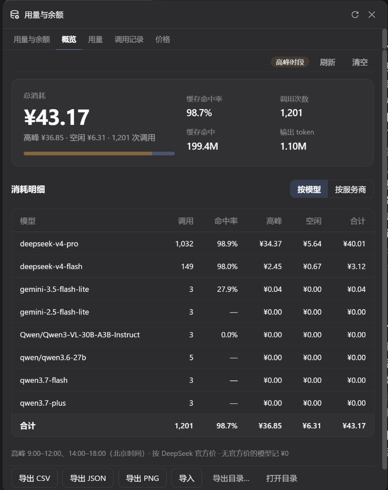
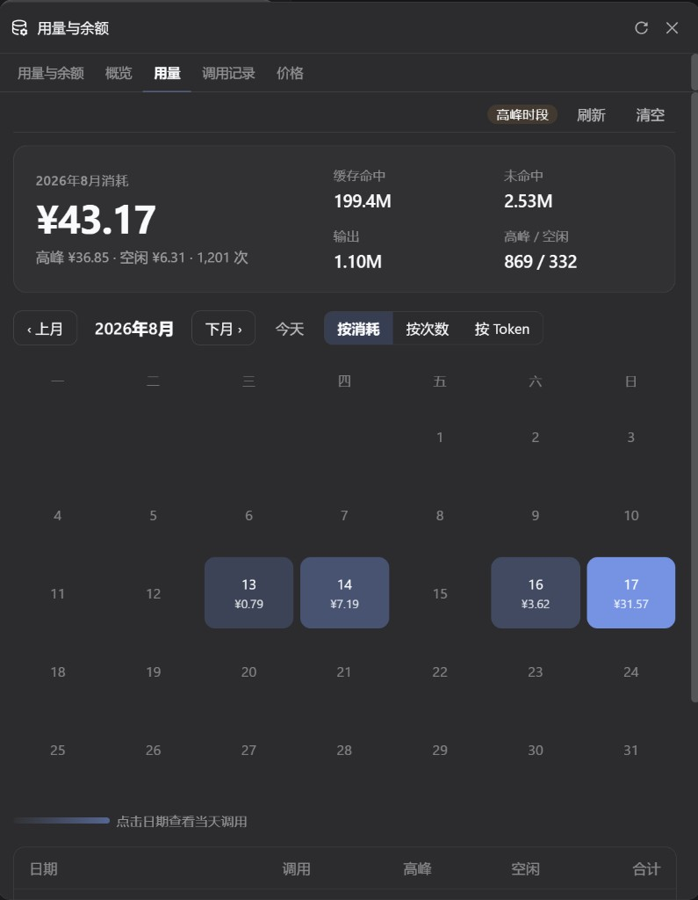

<div align="center">

# dsh-plugin-dosage

[English](./README.md) | **简体中文**

[GitHub](https://github.com/qingfeng200410/dsh-plugin-dosage) · MIT

DeepSeek Harness 的用量插件：侧栏一个入口，同时看多供应商余额和峰谷计费。


</div>

结合 [dsh-usage-stats](https://github.com/Ychris12138/dsh-usage-stats) 的账户监测，和 [dsh-usage-plugin](https://github.com/feiyang-dev/dsh-usage-plugin) 的逐次计费，做成同一个侧栏浮层。顶部「对话 / 轨迹」旁不再多出用量页签。

## 界面

**概览**



**用量**



## 装完能看到什么

侧栏底部点 **用量/余额**，浮层里五个页签：

| 页签 | 做什么 |
| --- | --- |
| 用量与余额 | 当前供应商的余额或 Token Plan，今日 / 本月 / 累计 Token，缓存命中，今日消耗，最近 14 天 |
| 概览 | 总消耗、高峰 / 空闲比例、按模型汇总 |
| 用量 | 月历热力图（按消耗、次数或 Token 着色），点某一天看明细 |
| 调用记录 | 每次调用的模型、命中率、结束原因、峰谷消耗；可按今天 / 7 天 / 30 天 / 全部筛选 |
| 价格 | DeepSeek 官方单价，`deepseek-v4-flash` 与 `deepseek-v4-pro` 上下排列，价格表不可改 |

调用记录和「最近 14 天」走同一套会话日志，不是两套数。浮层打开时，Token、今日消耗、当前供应商余额每 10 秒静默刷新。用量入口只在侧栏底部。

高峰按北京时间 **9:00–12:00、14:00–18:00** 计价；没有官方价的模型记 ¥0。

## 安装

需要 DeepSeek Harness 的 `web` profile，以及 `dsh`、`pnpm`。

```bash
dsh plugin --profile web add -w github:qingfeng200410/dsh-plugin-dosage#v1.13.0
```

装完**重启**已经在跑的 `dsh web`，浏览器硬刷新。侧栏底部会出现「用量/余额」。

其它 profile 把 `web` 换成对应名字即可。本地 tarball：

```bash
dsh plugin --profile web add ./dsh-plugin-dosage-1.13.0.tgz
```

### 升级

```bash
dsh plugin --profile web add -w github:qingfeng200410/dsh-plugin-dosage#v1.13.0
```

指定最新 tag 再 `add`。不要对 Git 引用使用 `dsh plugin update`。

### 卸载

```bash
dsh plugin --profile web remove dsh-plugin-dosage
```

卸载后重启。`~/.dsh/dsh-usage/` 里的记录不会删。

## 不要同时装

本插件已经包含那两份能力。再装会在侧栏出现两个入口，或抢同一组接口：

```bash
dsh plugin --profile web remove dsh-usage-stats
dsh plugin --profile web remove @feiyang666/dsh-usage-plugin
```

如果 `~/.dsh/profiles/web/cordis.patch.yml` 里还有 `name: dsh-usage-stats` 或旧的 `@feiyang666/...` 行，一并删掉。

## 账户与凭据

插件读取 Harness 已配置的供应商，凭据只在服务端解析，不会进浏览器。DeepSeek 用设置 → 模型里的 `DEEPSEEK_API_KEY` 即可。

| 供应商 | 模式 | 默认凭据 |
| --- | --- | --- |
| DeepSeek | 余额 | provider `apiKeyEnv` |
| OpenRouter | 余额 | **`OPENROUTER_MANAGEMENT_KEY`**（不能用推理 Key） |
| Moonshot / Kimi API | 余额 | provider `apiKeyEnv` |
| OpenCode Go | 订阅 | `OPENCODE_GO_API_KEY` 或本地 `auth.json` |
| Z.ai / 智谱 | 订阅 | `ZAI_API_KEY` |
| Kimi For Coding | 订阅 | `KIMI_API_KEY` |
| MiniMax Coding Plan | 订阅 | `MINIMAX_API_KEY` |
| New API / Sub2API / 自定义 | 见下方 `monitors` | credential ref |

没有公开账户接口的供应商仍会统计 Token，账户卡会标明「不支持余额」，不会猜数字。

New API、Sub2API 或声明式查询写在本插件自己的 Cordis 配置里，**不要**再挂一个 `dsh-usage-stats`：

```yaml
# ~/.dsh/profiles/web/cordis.patch.yml
- insert:
    - id: plugin-dosage
      name: 'dsh-plugin-dosage'
      config:
        monitors:
          relay-a:          # 必须是 Harness 里真实存在的 provider id
            adapter: new-api
```

完整 adapter 与安全边界见上游 [dsh-usage-stats](https://github.com/Ychris12138/dsh-usage-stats)。

## 数据目录

全部在用户级目录，不写进当前项目：

| 文件 | 位置 |
| --- | --- |
| 调用记录 | `~/.dsh/dsh-usage/usage-records.json`（上限 10 万条） |
| 价格配置 | `~/.dsh/dsh-usage/pricing.json` |
| 默认导出 | `~/.dsh/dsh-usage/{csv,json,images}/` |
| Token 聚合缓存 | `~/.dsh/storages/usage-stats-cache.json` |
| 启动诊断 | `~/.dsh/dsh-usage/dsh-usage-boot.log` |

`DSH_HOME` 已设置时，以上路径相对该目录。面板可导出 CSV / JSON / PNG，也可按时间去重导入。

## 常见问题

| 现象 | 处理 |
| --- | --- |
| 侧栏有两个「用量/余额」 | 卸掉独立的 `dsh-usage-stats`，并删掉 patch 里对应行 |
| 装完没有入口 | 重启 `dsh web` 并硬刷新；确认 `dsh plugin --profile web` 列出本包 |
| 面板报 `Unexpected end of JSON input` | Cordis 行缺少 `inject`。用上面的 `dsh plugin add` 重装，不要手改漏字段 |
| OpenRouter 显示未配置 | 在 `~/.dsh/.credentials.yaml` 写 `OPENROUTER_MANAGEMENT_KEY`，不要用推理 Key |
| `dsh plugin` 找不到 pnpm | `npm install -g pnpm` 或 `corepack enable` |

不要把 `.credentials.yaml`、API Key、Cookie 贴进 issue。

## 致谢与来源

本插件由下面两个 MIT 项目结合并优化而来：

| 项目 | 作者 | 许可 | 用了什么 |
| --- | --- | --- | --- |
| [dsh-usage-stats](https://github.com/Ychris12138/dsh-usage-stats) | Ychris12138 及贡献者 | MIT | 多供应商账户、Token 聚合、loopback API、侧栏用量/余额入口 |
| [dsh-usage-plugin](https://github.com/feiyang-dev/dsh-usage-plugin) | feiyang-dev | MIT | 峰谷计费、概览 / 用量 / 调用记录 / 价格、CSV/JSON/PNG 导出、`POST /usage/api` |
| [DeepSeek Harness](https://github.com/deepseek-ai/deepseek-harness) | DeepSeek | MIT | 宿主与 Cordis 插件运行时 |

在两者之上，本仓库主要做了这些整合、界面优化和功能增强：

- 两套能力收到侧栏一个 **用量/余额** 浮层（五个页签），去掉顶部「对话 / 轨迹」旁的用量页签和设置里的用量面板
- 重做概览 / 用量 / 调用记录 / 价格：总消耗主数字 + 峰谷比例、热力图空日不画格、调用记录列精简、价格卡上下排列
- 账户页补上缓存命中、命中率、今日消耗；该页去掉当月热力图，月历留在「用量」页；热力图增加 **按 Token**
- 调用记录与「最近 14 天」对齐同一套会话日志，不再只记插件截到的 stream 片段
- 浮层打开时 Token / 今日消耗 / 当前供应商余额每 10 秒刷新；点浮层外收起；高度按用量页锁定
- 用量数据改存用户级 `~/.dsh/dsh-usage/`，换项目不再另起一份；价格表按官方固定、不可编辑，没有官方价的模型记 ¥0，模型名如实显示

完整许可见 [LICENSE](./LICENSE) 与 [NOTICE](./NOTICE)。DeepSeek 是 DeepSeek 公司商标；本项目是社区插件，与 DeepSeek 无关联。

## 参与与说明

欢迎提交 Issue、Pull Request，一起改界面、修问题、补功能，如果喜欢可以点个 Star。

这是本人第一次公开开源的项目，经验有限，文档、代码和交互难免有疏漏，还请多多包涵。若使用中遇到问题，或认为内容涉及侵权、需要撤回，请通过 [Issues](https://github.com/qingfeng200410/dsh-plugin-dosage/issues) 联系我，核实后会尽快处理或删除。

## 许可

[MIT](./LICENSE)
